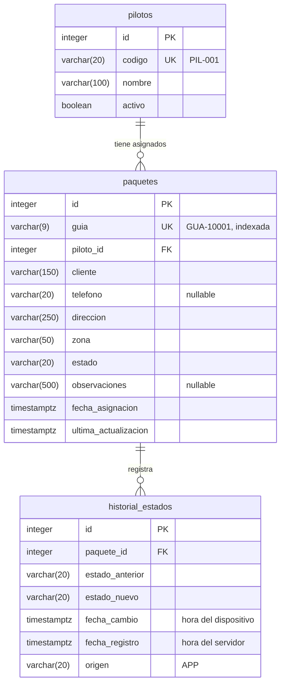

# Modelo de datos

PostgreSQL. Tablas y columnas en snake_case. Los estados se guardan como texto (`PENDIENTE`, `EN_RUTA`, `ENTREGADO`, `NO_ENTREGADO`). Las fechas son `timestamptz` y siempre se escriben en UTC.

## Relaciones

| Relación | Regla al borrar |
|---|---|
| `paquetes.piloto_id` → `pilotos.id` | `RESTRICT`: no se borra un piloto con paquetes. |
| `historial_estados.paquete_id` → `paquetes.id` | `CASCADE`: el historial se va con su paquete. |

## Índices

- `ix_pilotos_codigo`: único.
- `ix_paquetes_guia`: único; es la búsqueda principal de la app.
- `ix_paquetes_piloto_id`: para el listado por piloto.
- `ix_historial_estados_paquete_id`.

## Historial

Se inserta una fila por cada cambio **efectivo**. Los cambios obsoletos (`fecha_cambio` anterior a `ultima_actualizacion`) y los reenvíos idénticos no generan fila. `fecha_cambio` guarda el momento en que el piloto hizo el cambio y `fecha_registro` el momento en que llegó al servidor. La diferencia entre ambas muestra cuánto tiempo estuvo la app sin conexión.

## Datos de prueba

Se cargan con la migración `Inicial` (`HasData`), con fechas fijas (`2026-09-26T14:00:00Z`).

| Guía | Piloto | Estado |
|---|---|---|
| GUA-10001 | 1 | PENDIENTE |
| GUA-10002 | 1 | EN_RUTA |
| GUA-10003 | 1 | ENTREGADO |
| GUA-10004 | 1 | NO_ENTREGADO |
| GUA-10005 | 2 | PENDIENTE |
| GUA-10006 | 2 | EN_RUTA (sin teléfono) |
| GUA-10007 | 2 | PENDIENTE |
| GUA-10008 | 2 | ENTREGADO |
